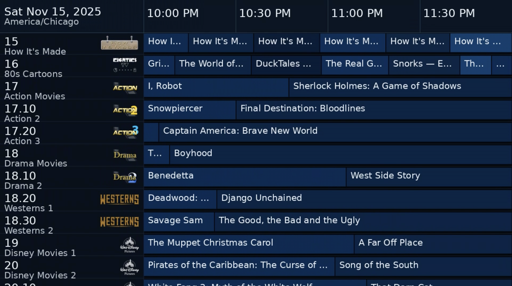

# XMLTV Guide Scroller → HLS

Old cable-style TV guide that ingests **XMLTV**, renders a scrolling guide (time across the top; channels scrolling vertically), and serves it as an **HLS stream** you can open in VLC or any HLS-capable player.



**Highlights**
- Date + timezone shown in the **top-left header cell** (doesn’t overlap times).
- **30‑minute time slots** across the header; ticks forward at each :00 and :30.
- **Cache mode (default):** pre-encodes a seamless loop MP4 per 30‑min block; HLS loops it forever.
- **Live mode:** render frames on the fly (higher CPU).
- **Logos**: pulls from `<icon src="...">` in XMLTV and displays beside channel names.
- **Music (optional):**
  - 1 file → loops forever.
  - 2+ files → randomized playlist forever (changes track when one finishes).
- **Theming:** built-in palettes + JSON overrides; program blocks use **muted colors** derived from your theme accent.
- **Robust HLS**: keeps playlist alive; restarts ffmpeg packager if it exits early.
- **Cache hygiene:** clears stale `.lock`/`.tmp` on start; purges old block MP4s.

---

## Requirements

- **Python** 3.8+ (3.9+ recommended)
- **ffmpeg** on PATH (`ffmpeg -version`)
- Python packages:
  ```bash
  pip install pillow requests
  # Needed if Python < 3.9 or Windows lacks tz database:
  pip install backports.zoneinfo tzdata
  ```

> **NVIDIA (optional):** For NVENC, use `--vcodec h264_nvenc` (or `hevc_nvenc`) and have recent NVIDIA drivers + ffmpeg built with NVENC.

---


## Docker quick start
```bash
# 1) Clone the git repo
git clone https://github.com/xmltv-guide-stream/xmltv-guide-stream.git

# 2) Change directory into the cloned repo
cd xmltv-guide-stream

# 3) Run docker compose build
docker compose build

# 4) Edit the docker-compose.yml file to match your XML TV source and timzezone
XMLTV_SRC=http://<IP of ErsatzTV server>:8409/iptv/xmltv.xml
XMLTV_TZ=<Your TZ>

# 5) Run the docker container (add -d after you make sure verything starts up correctly the first time)
docker compose up
```

## Quick start

```bash
# 1) (Recommended) Create a virtualenv
python -m venv .venv
# Windows:
. .venv\Scripts\activate
# macOS/Linux:
# source .venv/bin/activate

# 2) Install deps
pip install pillow requests
pip install backports.zoneinfo tzdata  # if needed

# 3) Run (cache mode)
python xmltv_guide_stream.py \
  --xmltv http://YOUR-IP:PORT/iptv/xmltv.xml \
  --tz America/Chicago \
  --hours 3 \
  --res 1920x1080 \
  --http-port 8000 \
  --vcodec h264_nvenc --nvenc-preset p5 --rc cbr \
  --bitrate 3000k --maxrate 3000k --bufsize 6000k \
  --theme classic
```

Open **`http://localhost:8000/guide.m3u8`** in VLC.

---

## Usage

### Common options
- `--xmltv` (required) : URL or path to XMLTV file.
- `--tz` : IANA timezone (e.g., `America/Chicago`).
- `--hours` : How many hours to show across the top (e.g., 2 or 3).
- `--res` : Output resolution, e.g. `1280x720`, `1920x1080`.
- `--fps` : Frame rate (default 30).
- Video encoding:
  - `--vcodec` : `libx264` (default), `h264_nvenc`, or `hevc_nvenc`.
  - `--nvenc-preset` : e.g., `p1`–`p7` (NVENC), or keep default.
  - `--rc`, `--bitrate`, `--maxrate`, `--bufsize`, `--profile`, `--pix-fmt`.
- HLS / HTTP:
  - `--hls-dir` : HLS output dir (default `hls_out`).
  - `--http-port` : Static file server port (default `8000`).  
  - `--packager-copy` : Use stream-copy HLS (no re-encode) when possible.
  - `--hls-verbose` : More ffmpeg logs.
- Layout / look:
  - `--row-height` : Row height in px (default 56).
  - `--left-col-w` : Left column width in px (default 360).
  - `--scroll-pps` : Scroll speed in px/sec (default 24).
  - `--font` : Path to a TTF for better typography.
  - `--no-logos` / `--logo-max-w` / `--logo-max-h`.
- Themes:
  - `--theme` : `classic` (default), `midnight`, `retro_blue`, `amber`, `mono_light`.
  - `--theme-file` : JSON file to override colors.
- Modes:
  - `--mode cache` (default) or `--mode live`.
  - `--cache-dir` : Where MP4 blocks are stored (default `cache_blocks`).
  - `--precache-blocks` : How many future blocks to prebuild (default 6).
  - `--cache-grace-sec` : Keep past blocks this many seconds for safety (default 300).
  - `--block-seconds` : Logical 30‑min blocks (don’t change unless you know why).
- Music:
  - `--music-dir` : Folder with audio files (default `music`).
  - `--no-music` : Disable background music.
  - `--music-volume` : 0.0–1.0 (default 0.25).

### Cache vs Live

**Cache mode (recommended):**
- Renders a seamless scrolling loop for the current 30‑min block once, then **loops that MP4** in HLS.
- Changes to the time bar occur when the real clock hits :00 or :30 (the next block is swapped in).
- Lower CPU; robust looping.

**Live mode:**
- Renders frames and feeds ffmpeg continuously.
- Useful for debugging or machines with plenty of CPU.

### Themes

Built-in themes: `classic`, `midnight`, `retro_blue`, `amber`, `mono_light`.

Blocks automatically use **muted colors** derived from your theme’s `accent`, blended with backgrounds for that authentic guide feel. You can override any color with a JSON file:

```json
{
  "bg": "#061018",
  "header_bg": "#0C1620",
  "grid_bg": "#0A121A",
  "row_sep": "#16222E",
  "text_primary": "#EAF2FA",
  "text_muted": "#A8B4C2",
  "accent": "#2EA5FF"
  // Omit "block_colors" to auto-derive muted block colors
}
```

Use with:
```bash
python xmltv_guide_stream.py ... --theme-file my_theme.json
```

### Music

Put audio files into `./music` (mp3, m4a, aac, flac, ogg, wav, opus).

- **Single file** → we feed ffmpeg with `-stream_loop -1`, so it loops forever.
- **Multiple files** → we generate a long **ffconcat** playlist shuffled across all files (repeated hundreds of times) and feed that to ffmpeg; **each time a track ends, a random next one plays**. No code changes needed.

Adjust volume with `--music-volume 0.25` (default).

### Logos

If your XMLTV contains `<channel>` entries with `<icon src="...">`, the guide fetches and caches each logo and shows it next to the channel name.

### Fonts

Use `--font` to point to a TTF (e.g., Montserrat) for crisper text:
```bash
--font "C:\path\to\Montserrat-VariableFont_wght.ttf"
```

---

## HLS playback tips

- VLC: open **Network Stream** → `http://localhost:8001/guide.m3u8`
- If playback stops early:
  - Ensure `hls_out/guide.m3u8` is being updated (segments keep appearing).
  - Confirm no firewall or proxy is interfering.

---

## Troubleshooting

**`ModuleNotFoundError: No module named 'zoneinfo'`**
- Install: `pip install backports.zoneinfo tzdata` (needed on Python < 3.9 or Windows without tz DB).

**`-vsync is deprecated. Use -fps_mode`**
- The script already uses `-fps_mode` on outputs that need it. The message can appear from your ffmpeg build when reading inputs; it’s harmless.

**VLC stops after ~30–40s**
- Use the default **cache mode** and ensure HLS uses `-hls_playlist_type event` and keeps producing segments. This repo’s defaults already do this. If it still occurs, check ffmpeg logs for early exits and that the music input is configured (silence won’t end the stream, but input errors might).

**NVENC specific issues**
- Use `--vcodec h264_nvenc --nvenc-preset p5 --rc cbr` and a bitrate/buffer suited to your GPU.
- Update NVIDIA drivers and ensure ffmpeg supports NVENC (`ffmpeg -encoders | findstr nvenc`).

**Unicode text / fonts**
- If you see `UnicodeEncodeError` in PIL when drawing text, switch to a TTF font via `--font` that supports your language glyphs.

**Port already in use**
- Change the port: `--http-port 8002`

---

## Project structure

```
xmltv_guide_stream.py   # the app
hls_out/                    # HLS playlist/segments (generated)
cache_blocks/               # MP4 loops per 30-min block (generated)
music/                      # optional audio files
```

---

## License

**MIT**
